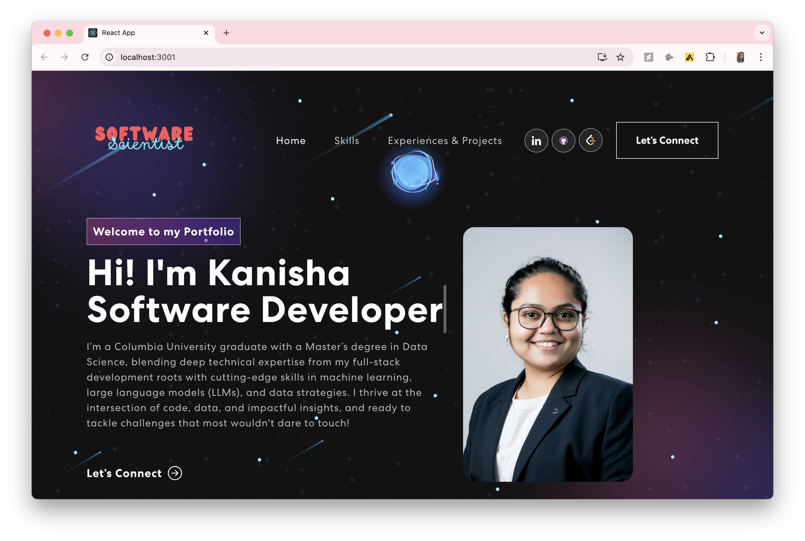

# 🚀 Kanisha Shah - Portfolio

Welcome to my **personal portfolio website**, where I showcase my **projects, skills, and experience** in **Software Development, Data Science, and Machine Learning**. This website is built to reflect my technical journey and passion for problem-solving, innovation, and AI-driven solutions.

## 🌐 Live Demo
Check out my portfolio: **[Kanisha Shah's Portfolio](https://kanisha-shah.github.io/#home)**  

---

## 🔥 Features
- **Professional Overview** - A brief introduction about me, my background, and career highlights.
- **Skills Section** - Highlights my expertise in **Machine Learning, Software Engineering, Data Science, and Web Development**.
- **Projects Showcase** - Displays my top **research, data-driven projects, and full-stack applications**.
- **Experience & Achievements** - Lists my **internships, research contributions, and recognitions**.
- **Responsive UI** - Designed for **desktop & mobile-friendly** experience.
- **Smooth Animations** - Integrated with `animate.css` & `react-bootstrap` for a sleek UI.

---

## 🛠 Tech Stack
This portfolio is built with modern **frontend and backend technologies**:

### **Frontend**
- **React.js** - Component-based UI
- **Bootstrap / React-Bootstrap** - Styling & responsive design
- **CSS3 & Animate.css** - Smooth animations
- **JavaScript (ES6+)** - Dynamic interactions
- **GitHub Pages** - Deployment  

---

## 📸 Screenshots

---

This portfolio was created as part of my journey while learning React, using inspiration and reference from this GitHub repository:
🔗 [GitHub Reference](https://github.com/judygab/web-dev-projects/tree/main/personal-portfolio)

I’ve incorporated various images from Google as well as from:
🎨 [iStockPhoto](https://www.istockphoto.com/illustrations/school-club)

I’m constantly working on improving and updating my portfolio. Feel free to explore and let me know if you have any suggestions or feedback—I’d love to hear your thoughts!

---

📬 Contact Me

📧 Email: kanisha.shah@columbia.edu

💻 GitHub: [github.com/Kanisha-Shah](https://github.com/Kanisha-Shah)

🔗 LinkedIn: [linkedin.com/Kanisha-Shah](https://www.linkedin.com/in/kanisha-shah97/)